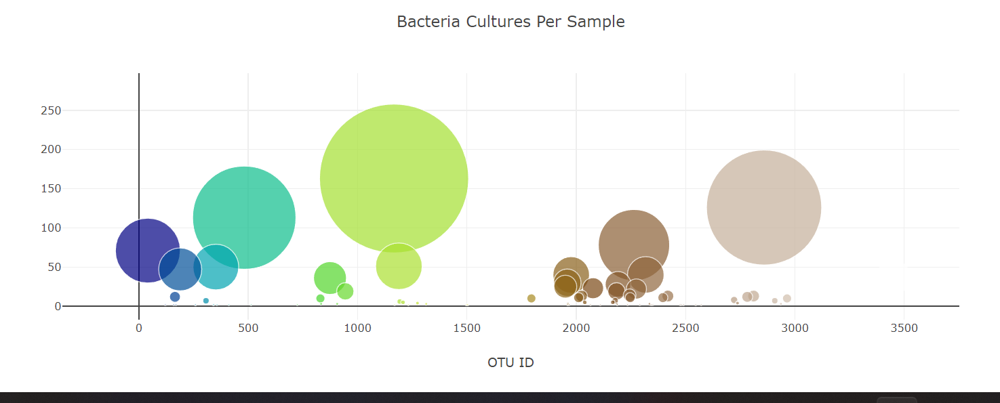
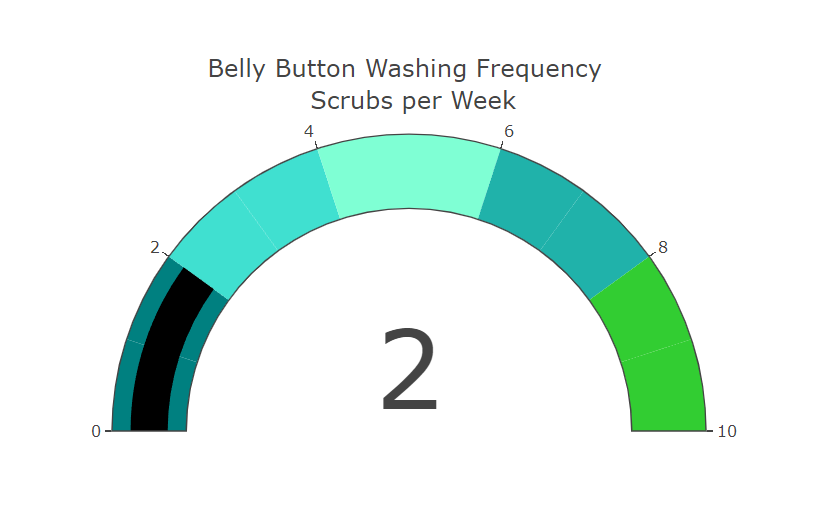

# Plotly_Challenge

## Purpose & Overview

This project has been undertaken on behalf of Roza, a biological researcher in a prominent micro-biology laboratory. Many bacteria species are not well studied and many remain unknown to science. Roza's role is to discover and document such bacteria. In particular, Roza is interested in bacterial species found in human navel that have ability to synthesize proteins that taste like beef.Her lab is partnered with Improbable Beef, a food start-up to research candidate species. 

For this purpose, we have built an interactive dashboard to explore the Belly Button Biodiversity dataset. As we enter the ID number for our test subject, the webpage is updated with their demographic information, the Top 10 bacteria cultures found in the test subject along with their belly button washing frequency.

## Tools Used

- Plotly
- JavaScript
- HTML

## Screenshots of the Plotly Charts

### Demographic Information

### Bar chart 

### Bubble Chart 

### Guage Chart

## Overview of the webpage

